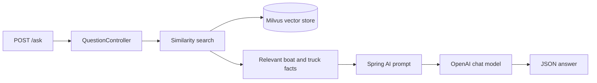

# Spring AI RAG Expert

> Ask a question in plain English. Let Spring AI find the facts before the
> language model writes the answer.

This project is a deliberately small, end-to-end example of
[retrieval-augmented generation (RAG)](https://www.ibm.com/think/topics/retrieval-augmented-generation)
with Spring Boot, Spring AI, OpenAI, and Milvus. Its sample domain is practical:
choose the least expensive truck that can safely tow a specific boat.

The application does not rely on the model's general knowledge for those
recommendations. It retrieves facts from a searchable knowledge base containing
truck prices, towing capacities, and boat specifications, then includes the
relevant facts in the prompt sent to the chat model.

## How it works



On the first run, the bootstrap component reads the local truck data and the
configured boat documents, splits them into chunks, creates embeddings, and
stores them in Milvus. For every request, the five most relevant chunks are
retrieved and supplied as context.

## Requirements

- Java 21
- Docker Desktop (or another Docker Compose-compatible installation)
- An OpenAI API key

## Quick start

### 1. Start the application

You need an OpenAI API key, Java 21, and Docker. From the repository root:

```bash
export OPENAI_API_KEY="your-openai-api-key"
docker compose up -d
./mvnw spring-boot:run
```

Windows users can set the key with `set OPENAI_API_KEY=your-openai-api-key`
before running `mvnw.cmd spring-boot:run`.

The API is available at `http://localhost:8080`. Milvus starts with etcd and
MinIO; allow those containers to become healthy before the Spring application
loads the documents. The initial indexing step may also download the boat
specification pages configured in `application.yaml`.

### 2. Ask your first question

Copy, paste, and run:

```bash
curl --location 'http://localhost:8080/ask' \
  --header 'Content-Type: application/json' \
  --data '{
    "question": "What is a good truck to pull a Sportsman 232 boat?"
  }'
```

The response has this shape:

```json
{
  "answer": "The Sportsman Open 232 boat has a tested weight of 5,001 lbs. ..."
}
```

For the question above, a typical response is:

```json
{
  "answer": "The Sportsman Open 232 boat has a tested weight of 5,001 lbs. To safely tow this boat, you need a truck with a towing capacity greater than 5,001 lbs.\n\nThe cheapest option that meets the towing requirement is the Chevy Colorado, which costs $55,000 and can tow up to 7,000 lbs."
}
```

## Try different prompts

The endpoint accepts any question in the `question` property. These examples
are designed to show progressively more useful prompts:

### Find the cheapest safe match

```bash
curl --location 'http://localhost:8080/ask' \
  --header 'Content-Type: application/json' \
  --data '{
    "question": "What is a good truck to pull a Sportsman 232 boat? Recommend the cheapest truck that can safely tow it. Show the boat weight, truck price, and towing capacity."
  }'
```

Example successful response:

```json
{
  "answer": "The Sportsman Open 232 boat has a tested weight of 5,001 lbs. Therefore, you need a truck that can tow more than 5,001 lbs.\n\nThe cheapest truck that can safely tow this weight is the Chevy Colorado, which costs $55,000 and has a towing capacity of up to 7,000 lbs.\n\n- Boat Tested Weight: 5,001 lbs\n- Truck: Chevy Colorado\n- Truck Price: $55,000\n- Truck Towing Capacity: 7,000 lbs"
}
```

### Explain why a truck is not suitable

```bash
curl --location 'http://localhost:8080/ask' \
  --header 'Content-Type: application/json' \
  --data '{
    "question": "Can the Chevy Traverse tow the Sportsman 232 boat? Compare the tested boat weight with its towing capacity and explain the safety margin."
  }'
```

Example response:

```json
{
  "answer": "The Chevy Traverse cannot tow the Sportsman 232 boat safely. The Chevy Traverse has a towing capacity of up to 5,000 pounds, while the tested boat weight is 5,001 pounds. The boat exceeds the truck's capacity by 1 pound, so towing it with a Chevy Traverse is not recommended."
}
```

### Compare the complete range

```bash
curl --location 'http://localhost:8080/ask' \
  --header 'Content-Type: application/json' \
  --data '{
    "question": "Which is the cheapest truck that can tow a Sportsman 212 boat? Compare all suitable options by price and towing capacity, then recommend one."
  }'
```

Example response:

```json
{
  "answer": "The Sportsman 212 boat has a tested weight of 3,458 lbs. The cheapest truck that can tow it is the Chevy Traverse, which costs $43,000 and has a towing capacity of up to 5,000 lbs."
}
```

### Test a heavy boat

```bash
curl --location 'http://localhost:8080/ask' \
  --header 'Content-Type: application/json' \
  --data '{
    "question": "Can the Chevy 2500 tow the Sportsman 322 boat? Compare the tested boat weight with the truck towing capacity and recommend the cheapest suitable option."
  }'
```

Example response:

```json
{
  "answer": "The Chevy 2500 has a towing capacity of 14,500 pounds. The Sportsman Open 322 boat has a tested weight of 12,479 pounds, so the Chevy 2500 can tow it. At $75,000, it is the cheapest listed truck suitable for this boat."
}
```

The model is instructed to answer from the retrieved documents and to say when
the documents do not provide enough information. Responses can still vary in
wording because they are generated by the chat model.

The examples show shortened responses for readability. Actual responses may
include more explanation, Markdown formatting, or different line breaks.

If the application cannot reach OpenAI or Milvus, Spring Boot returns an HTTP
500 response. Check the application logs first; common causes are an unset
`OPENAI_API_KEY`, unavailable Milvus containers, or a failed remote document
download during initial indexing.

## Data and configuration

The default knowledge base is configured in
[`src/main/resources/application.yaml`](src/main/resources/application.yaml):

| Source | Contents |
| --- | --- |
| `src/main/resources/towvehicles.txt` | Truck prices and towing capacities |
| `documentsToLoad` in `application.yaml` | Local and remote boat specifications |
| Milvus collection `vector_store` | Document chunks and embeddings |
| OpenAI `text-embedding-3-small` | Embeddings used for retrieval |
| OpenAI `gpt-4-turbo` | Generated answers |

To add another source, add it to `documentsToLoad` or replace the local dataset.
If the source data changes and you need to re-index it, stop the containers,
remove the local Milvus data, and start again:

```bash
docker compose down
rm -rf volumes
docker compose up -d
```

Only remove `volumes` when you intentionally want to recreate the vector store.

## Project structure

```text
src/main/java/.../controllers/  HTTP endpoint
src/main/java/.../services/     Retrieval and OpenAI prompt orchestration
src/main/java/.../bootstrap/    Startup document loading and chunking
src/main/resources/             Configuration, prompts, and source data
docker-compose.yml               Milvus, MinIO, and etcd infrastructure
```

## Stop, build, and test

Stop the infrastructure when you are finished:

```bash
docker compose down
```

Run the automated tests:

```bash
./mvnw test
```

## Related Spring Framework Guru courses

- [Spring Framework 6 - Beginner to Guru](https://www.udemy.com/course/spring-framework-6-beginner-to-guru/?referralCode=2BD0B7B7B6B511D699A9)
- [API First Engineering with Spring Boot](https://www.udemy.com/course/api-first-engineering-with-spring-boot/?referralCode=C6DAEE7338215A2CF276)
- [Introduction to Kafka with Spring Boot](https://www.udemy.com/course/introduction-to-kafka-with-spring-boot/?referralCode=15118530CA63AD1AF16D)
- [Spring Security: Beginner to Guru](https://www.udemy.com/course/spring-security-core-beginner-to-guru/?referralCode=306F288EB78688C0F3BC)

More Spring content is available on the [Spring Framework Guru blog](https://springframework.guru/)
and [YouTube channel](https://www.youtube.com/channel/UCrXb8NaMPQCQkT8yMP_hSkw).
